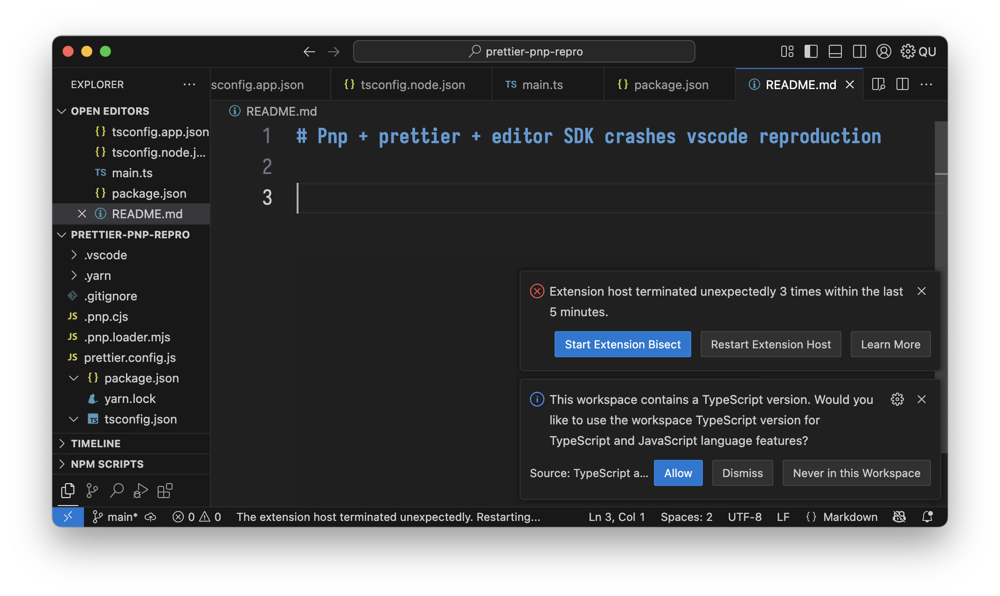

# Pnp + prettier + editor SDK crashes vscode reproduction



minimal reproduction repo, reliably crashes extension host in code-insiders.
major contributor seems to be `.pnp.loader.mjs` as uninstalling `@vitejs/plugin-react-swc` removes it and makes the crash stop.

```
Version: 1.101.0-insider (Universal)
Commit: 496ebc4723371f29c9ffa0319dcccb2d7bee7ee0
Date: 2025-05-21T05:04:29.987Z
Electron: 35.4.0
ElectronBuildId: 11602177
Chromium: 134.0.6998.205
Node.js: 22.15.0
V8: 13.4.114.21-electron.0
OS: Darwin arm64 24.4.0
```
